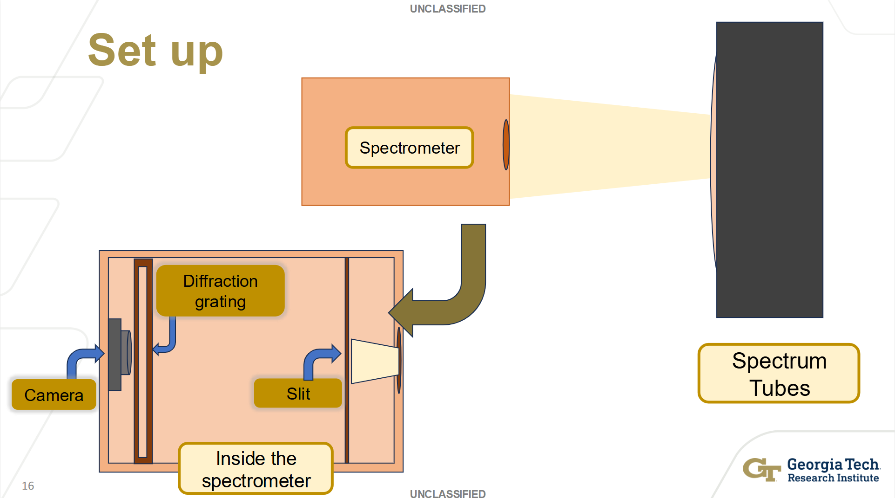
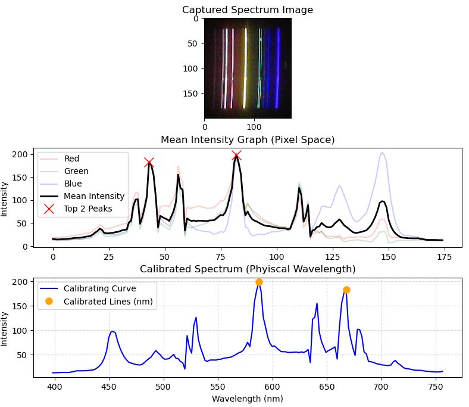
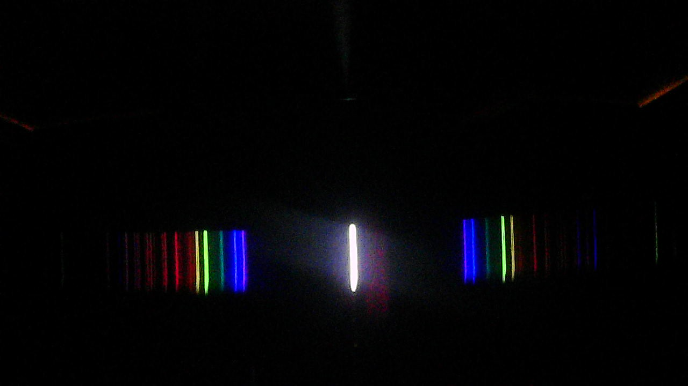
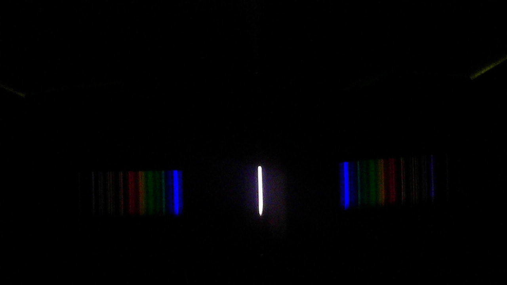

# STEM@GTRI 2026: Low-Cost Compact Spectrometer
**High School Interns:** Alexandra Campos, Haywan Deneke, Jeanee Omotayo, Advaith Shankaran <br>
**GTRI Mentors:** Holly Tinkey, Ryan McGill, Joshua Herring, Darian Hartsell<br>
**College Student:** Isha Madanu


## Description
A DIY diffraction-based spectrometer. The project uses a Python script to convert webcam images into intensity data and maps those readings to specific wavelengths for analyzing light spectra.

## Repository Contents
* `/src`: Contains Python scripts.
* `/cad`: Contains STL files for the physical assembly.
* `/images`: Contains representative images/results of the project.

## Code Documentation
**File:** `spectrometerCode.py` (Intern Code)

### How It Works
* The script processes live images from the DIY spectrometer, crops the region of interest, and identifies spectral peaks using Python libraries, such as OpenCV, SciPy, and NumPy.

### How to Run
1. Create and activate the Conda environment
    ```
    conda create -n spectrometer_env python=3.10
    conda activate spectrometer_env
    ```
2. Ensure dependencies are installed: `pip install -r requirements.txt`
3. Run the script: `python spectrometerCode.py`
4. Update the fixed ROI to capture live spectrum; Set `used_saved` to False when calibrating set up. 
<br>

#### Note: Configuring the Environment:
If you are using VSCode IDE:
1. Open the Command Palette (Ctrl+Shift+P on Windows/Linux, Cmd+Shift+P on macOS).
2. Type "Python: Select Interpreter"
3. Select the entry labeled: `Python 3.10.x ('spectrometer_env': conda)`

## Physical Design
* **Software used:** FreeCAD
* **Components:** 
    * Enclosure: Laser Cut with $3\text{ mm}$ wood, painted black, and $2\text{ mm}$ black acrylic
        - $200 \times 200 \times 100\text{ mm}$ outer casing; wood
        - $192 \times 97\text{ mm}$ wall with slit of width $.05\text{ mm}$ in center; acrylic
        - $192 \times 96\text{ mm}$ wall with $20 \times 20\text{ mm}$ cutout in center; acrylic
    * Internal Mounting: 3D-print internal component mounts and brackets using black PLA
        - Camera Mount: `Cameraholder3.stl`
        - Diffraction Grating ($500 \text{ lines/mm}$) Case: `gratingBodyNew.stl`
        - Lid Slider, mounted to enclsoure: `sliderLid.stl`

<p align="center">

</p>

## Data Collection (Intern)
- Helium (Used for Calibration)
<p>

</p>

- Mercury
<p>

</p>

- Argon
<p>

</p>

## Classification 
(Isha)
* Manual Classification: `classification/manualClassification.py`
    * Uses stored spectral peaks from NIST dataset of designated elements to classify unknown light sources.
* Random Forest for Classification:
    * Model 1: `classification/classificationForest.py`
        * Extracts top 5 highest-intensity peaks from data to create a 10-feature vector
        * Augments this data by adding random Gaussian noise to wavelengths and uniform noise to intensities to create a synthetic dataset
        * **Retired** due to data leakage. Since the training and testing sets are created by augmetning the same NIST base samples, the model memorizes static NIST peak values rather than generalizing. Thus, leading to overfitting.
    * Model 2: `classification/classificationForestSim.py`
        * Uses [simLIBS](https://pypi.org/project/SimulatedLIBS/) library to simulate light spectra
        * Trains model by mapping entire simulated spectrum onto a grid
    ### How to Run
    Choose from classification models above:
    * Manual Classification: 
        1. Use `spectrometerCode.py` to collect spectral data
        2. Run `classification/manualClassification.py`
    * Random Forest Model:
        1. Import your own images to `spectrometerDataRetrieval.py` from a single calibrated set up and run file. Or use the images in `prototypeImages`, which are of the same calibrated setup.


## Limitations and Future Work
* **Spectrometer:** Images collected from spectrometer show ambient light from light source, coming through the slit. This noise interferes with the intensity values of the spectrum.
    * **Improvement:** Subtract the background light using OpenCV. Within the physical model, creating solid walls in lieu of the slit could prevent the light from dispersing before reaching the diffraction grating.
    * **Future Work:** Next steps would be to implement an effective, automated classification system to identify the elemental composition of light sources from Intensity vs Wavelength output. Interns also wanted to see the use cases of compact spectrometers if applied to mobile phones.
* **Classification:** 
    * **Manual Classification**: Classification is limited to the elements listed in the dictionary.
        * **Improvement:** Replacing the dictionary with an NIST-compiled CSV.
    * **Random Forest Model 2**: Currently analyzing results on limited data with prototype spectrometer. Accurate results shown for Helium and Mercury spectra. Xenon, Neon, Argon images contain less distinct lines, which potentially interferes with classification.